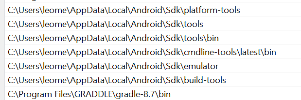

## Installation CORDOVA

https://cordova.apache.org/docs/en/latest/

## Installation CORDOVA / ANDROID STUDIO
1.  npm install -g cordova dans le dossier racine
2. installer jdk 11 (j'utilise : Java JDK: installed 11.0.17)
3. avoir JAVA_HOME dans les variables d'environnement
4. installer android_studio en suivant la doc (pas oublier d'installer tous les packages du JDK manager) https://cordova.apache.org/docs/en/12.x/guide/platforms/android/index.html#requirements-and-support
5. pas oublier d'ajouter les 3-4 path mentionnés dans la doc

6. Installer graddle pour pouvoir l'ajouter dans les variables d'environnement (cf la dernière ligne du screen du dessus)
7. avoir ANDROID_HOME dans les variables d'environnement qui point sur le dossier sdk de android studio

## Run l'app
2. ` sudo ./coolWarApp`
3. normalement : ` cordova emulate android`   (mais moi ça marche pas ptn)
4. ` cordova run android`
   OU
5. avoir un tel externe branché et juste copié collé le .apk généré quand on fait ` cordova build android` 

## Installation plugins

1 cordova plugin add onesignal-cordova-plugin
2. cordova plugin add cordova-plugin-lottie-splashscreen https://github.com/timbru31/cordova-plugin-lottie-splashscreen/tree/master

